# Poolgress 闖關流程圖（單一 Mermaid）

> 全部內容集中在下方同一個 ```mermaid``` 圖；直接編輯即可。
> 預覽：貼到 https://mermaid.live 、VS Code Mermaid 外掛，或放上 GitHub。
> 判斷：`關卡種類：`（重複／球型／無限）決定大分支；`關卡選項：` 決定子分支。✦＝目前網頁已實作。
> 節點前綴：重複 ra純子球 / rb經典 / rc子球換位 / rd母球換位 / re8做9 / rf解球；
> 球型 bs純子球照順序 / bl照順序 / by任意順序；無限 inf一顆球無限 / tb兩顆球無限。
> 步驟4 說明視窗：關卡說明←`關卡說明：`、關卡要求←`關卡要求：`下的`通則：`、過關條件←`過關條件：`。

```mermaid
flowchart TD
  %% ========== 主流程 ==========
  S([開始]) --> P1[1 打開 APP] --> P2[2 點選遊戲關卡] --> P3[3 載入關卡資訊] --> P4[4 進入遊戲說明視窗] --> P5[5 選擇遊戲地點]
  P5 --> KIND{"依「關卡種類」＋「關卡選項」分流"}

  %% ----- 步驟6 進行中的側邊分支 -----
  KIND -.->|返回鍵| GIVEUP{要放棄遊戲嗎？}
  GIVEUP -->|放棄| P4
  GIVEUP -->|繼續玩| KIND
  KIND -.->|說明鍵| HELP[關卡說明視窗]
  HELP -->|關閉| KIND

  %% ========== 關卡種類 → 關卡選項 ==========
  KIND -->|重複關卡| KR["重複關卡"]
  KIND -->|球型關卡| KB["球型關卡"]
  KIND -->|無限關卡| KI["無限關卡"]

  KR --> optR1["純子球＿位置固定"]
  KR --> optR2["經典＿子母球位置固定 ✦"]
  KR --> optR3["子球換位置，母球位置固定"]
  KR --> optR4["母球換位置，子球位置固定"]
  KR --> optR5["8做9＿子1子2母球位置固定"]
  KR --> optR6["解球關卡＿子母球位置固定"]

  KB --> optB1["純子球，要照順序"]
  KB --> optB2["照順序 ✦"]
  KB --> optB3["任意順序"]

  KI --> optI1["一顆球無限 ✦"]
  KI --> optI2["兩顆球無限"]

  %% ========== 重複關卡 6 份步驟6（ra～rf） ==========
  subgraph SGRa["重複關卡 ▸ 純子球＿位置固定"]
    ra0["6.0 模板載入（標示：過關總次數）"] --> ra1["6.1 球桌資訊標記"] --> ra2["6.2 播放音效：請擺球"] --> ra3["6.3 開始偵測球體"] --> ra4["6.4 播放音效：開始擊球"] --> ra5["6.5 等待玩家擊球"] --> ra6["6.6 擊球瞬間，畫面清空剩下目標物"] --> ra7{"6.7 擊球判定"}
    ra7 -->|成功| raA1["6.8-1 播放音效：成功"] --> raA2["6.9-1 結果宣告：本桿成功 😀"]
    ra7 -->|失敗| raB1["6.8-2 播放音效：失敗"] --> raB2["6.9-2 結果宣告：本桿失敗 😢"]
    raA2 --> ra10["6.10 關卡重複"]
    raB2 --> ra10
    ra10 -->|未達總次數| ra1
    ra10 -->|已達總次數| ra11["6.11 關卡重複結束"]
  end

  subgraph SGRb["重複關卡 ▸ 經典＿子母球位置固定"]
    rb0["6.0 模板載入（標示：過關總次數）"] --> rb1["6.1 球桌資訊標記"] --> rb2["6.2 播放音效：請擺球"] --> rb3["6.3 開始偵測球體"] --> rb4["6.4 播放音效：開始擊球"] --> rb5["6.5 等待玩家擊球"] --> rb6["6.6 擊球瞬間，畫面清空剩下目標物"] --> rb7{"6.7 擊球判定"}
    rb7 -->|成功| rbA1["6.8-1 播放音效：成功"] --> rbA2["6.9-1 結果宣告：本桿成功 😀"]
    rb7 -->|失敗| rbB1["6.8-2 播放音效：失敗"] --> rbB2["6.9-2 結果宣告：本桿失敗 😢"]
    rbA2 --> rb10["6.10 關卡重複"]
    rbB2 --> rb10
    rb10 -->|未達總次數| rb1
    rb10 -->|已達總次數| rb11["6.11 關卡重複結束"]
  end

  subgraph SGRc["重複關卡 ▸ 子球換位置，母球位置固定"]
    rc0["6.0 模板載入（標示：過關總次數）"] --> rc1["6.1 球桌資訊標記"] --> rc2["6.2 播放音效：請擺球"] --> rc3["6.3 開始偵測球體"] --> rc4["6.4 播放音效：開始擊球"] --> rc5["6.5 等待玩家擊球"] --> rc6["6.6 擊球瞬間，畫面清空剩下目標物"] --> rc7{"6.7 擊球判定"}
    rc7 -->|成功| rcA1["6.8-1 播放音效：成功"] --> rcA2["6.9-1 結果宣告：本桿成功 😀"]
    rc7 -->|失敗| rcB1["6.8-2 播放音效：失敗"] --> rcB2["6.9-2 結果宣告：本桿失敗 😢"]
    rcA2 --> rc10["6.10 關卡重複"]
    rcB2 --> rc10
    rc10 -->|未達總次數| rc1
    rc10 -->|已達總次數| rc11["6.11 關卡重複結束"]
  end

  subgraph SGRd["重複關卡 ▸ 母球換位置，子球位置固定"]
    rd0["6.0 模板載入（標示：過關總次數）"] --> rd1["6.1 球桌資訊標記"] --> rd2["6.2 播放音效：請擺球"] --> rd3["6.3 開始偵測球體"] --> rd4["6.4 播放音效：開始擊球"] --> rd5["6.5 等待玩家擊球"] --> rd6["6.6 擊球瞬間，畫面清空剩下目標物"] --> rd7{"6.7 擊球判定"}
    rd7 -->|成功| rdA1["6.8-1 播放音效：成功"] --> rdA2["6.9-1 結果宣告：本桿成功 😀"]
    rd7 -->|失敗| rdB1["6.8-2 播放音效：失敗"] --> rdB2["6.9-2 結果宣告：本桿失敗 😢"]
    rdA2 --> rd10["6.10 關卡重複"]
    rdB2 --> rd10
    rd10 -->|未達總次數| rd1
    rd10 -->|已達總次數| rd11["6.11 關卡重複結束"]
  end

  subgraph SGRe["重複關卡 ▸ 8做9＿子1子2母球位置固定"]
    re0["6.0 模板載入（標示：過關總次數）"] --> re1["6.1 球桌資訊標記"] --> re2["6.2 播放音效：請擺球"] --> re3["6.3 開始偵測球體"] --> re4["6.4 播放音效：開始擊球"] --> re5["6.5 等待玩家擊球"] --> re6["6.6 擊球瞬間，畫面清空剩下目標物"] --> re7{"6.7 擊球判定"}
    re7 -->|成功| reA1["6.8-1 播放音效：成功"] --> reA2["6.9-1 結果宣告：本桿成功 😀"]
    re7 -->|失敗| reB1["6.8-2 播放音效：失敗"] --> reB2["6.9-2 結果宣告：本桿失敗 😢"]
    reA2 --> re10["6.10 關卡重複"]
    reB2 --> re10
    re10 -->|未達總次數| re1
    re10 -->|已達總次數| re11["6.11 關卡重複結束"]
  end

  subgraph SGRf["重複關卡 ▸ 解球關卡＿子母球位置固定"]
    rf0["6.0 模板載入（標示：過關總次數）"] --> rf1["6.1 球桌資訊標記"] --> rf2["6.2 播放音效：請擺球"] --> rf3["6.3 開始偵測球體"] --> rf4["6.4 播放音效：開始擊球"] --> rf5["6.5 等待玩家擊球"] --> rf6["6.6 擊球瞬間，畫面清空剩下目標物"] --> rf7{"6.7 擊球判定"}
    rf7 -->|成功| rfA1["6.8-1 播放音效：成功"] --> rfA2["6.9-1 結果宣告：本桿成功 😀"]
    rf7 -->|失敗| rfB1["6.8-2 播放音效：失敗"] --> rfB2["6.9-2 結果宣告：本桿失敗 😢"]
    rfA2 --> rf10["6.10 關卡重複"]
    rfB2 --> rf10
    rf10 -->|未達總次數| rf1
    rf10 -->|已達總次數| rf11["6.11 關卡重複結束"]
  end

  %% ========== 球型關卡 3 份步驟6′（bs／bl／by） ==========
  subgraph SGBs["球型關卡 ▸ 純子球，要照順序"]
    bs0["6.0 模板載入（標示：過關總次數）"] --> bs1["6.1 球桌資訊標記"] --> bs2["6.2 播放音效：請擺球"] --> bs3["6.3 開始偵測球體"] --> bs4["6.4 播放音效：開始擊球"] --> bs5["6.5 等待玩家擊球"] --> bs6["6.6 擊球瞬間（球正在滾）"] --> bs7{"6.7 擊球判定"}
    bs7 -->|成功| bsA1["6.8-1 播放音效：成功"] --> bsA2["6.9-1 結果宣告：本桿成功 😀"] --> bsO["6.10-1 繼續下一桿"]
    bs7 -->|失敗| bsB1["6.8-2 播放音效：失敗"] --> bsB2["6.9-2 結果宣告：本桿失敗 😢"] --> bsFail["6.11-2 關卡失敗"]
    bsO -->|打進最後一顆球| bsPass["6.11-1 關卡通過"]
    bsO -->|"還有球（依關卡要求）"| bsRule{規則需求？}
    bsRule -->|要照順序打| bsC1["6.3-1 確定剩下球體（移除最小號子球）"]
    bsRule -->|任意順序| bsC2["6.3-2 確認打進的子球（移除已打進的）"]
    bsC1 --> bs3
    bsC2 --> bs3
    bs3 -.->|重複時略過 6.4| bs5
  end

  subgraph SGB["球型關卡 ▸ 照順序"]
    bl0["6.0 模板載入（標示：過關總次數）"] --> bl1["6.1 球桌資訊標記"] --> bl2["6.2 播放音效：請擺球"] --> bl3["6.3 開始偵測球體"] --> bl4["6.4 播放音效：開始擊球"] --> bl5["6.5 等待玩家擊球"] --> bl6["6.6 擊球瞬間（球正在滾）"] --> bl7{"6.7 擊球判定"}
    bl7 -->|成功| blA1["6.8-1 播放音效：成功"] --> blA2["6.9-1 結果宣告：本桿成功 😀"] --> blO["6.10-1 繼續下一桿"]
    bl7 -->|失敗| blB1["6.8-2 播放音效：失敗"] --> blB2["6.9-2 結果宣告：本桿失敗 😢"] --> blFail["6.11-2 關卡失敗"]
    blO -->|打進最後一顆球| blPass["6.11-1 關卡通過"]
    blO -->|"還有球（依關卡要求）"| blRule{規則需求？}
    blRule -->|要照順序打| blC1["6.3-1 確定剩下球體（移除最小號子球）"]
    blRule -->|任意順序| blC2["6.3-2 確認打進的子球（移除已打進的）"]
    blC1 --> bl3
    blC2 --> bl3
    bl3 -.->|重複時略過 6.4| bl5
  end

  subgraph SGBy["球型關卡 ▸ 任意順序"]
    by0["6.0 模板載入（標示：過關總次數）"] --> by1["6.1 球桌資訊標記"] --> by2["6.2 播放音效：請擺球"] --> by3["6.3 開始偵測球體"] --> by4["6.4 播放音效：開始擊球"] --> by5["6.5 等待玩家擊球"] --> by6["6.6 擊球瞬間（球正在滾）"] --> by7{"6.7 擊球判定"}
    by7 -->|成功| byA1["6.8-1 播放音效：成功"] --> byA2["6.9-1 結果宣告：本桿成功 😀"] --> byO["6.10-1 繼續下一桿"]
    by7 -->|失敗| byB1["6.8-2 播放音效：失敗"] --> byB2["6.9-2 結果宣告：本桿失敗 😢"] --> byFail["6.11-2 關卡失敗"]
    byO -->|打進最後一顆球| byPass["6.11-1 關卡通過"]
    byO -->|"還有球（依關卡要求）"| byRule{規則需求？}
    byRule -->|要照順序打| byC1["6.3-1 確定剩下球體（移除最小號子球）"]
    byRule -->|任意順序| byC2["6.3-2 確認打進的子球（移除已打進的）"]
    byC1 --> by3
    byC2 --> by3
    by3 -.->|重複時略過 6.4| by5
  end

  %% ========== 無限關卡 一顆球無限（inf） ==========
  subgraph SGI["無限關卡 ▸ 一顆球無限"]
    inf0["6.0 紀錄載入（標示：最高紀錄／目前挑戰）"] --> inf1["6.1 球桌資訊標記"] --> inf2["6.2 播放音效：請擺球"] --> inf3["6.3 開始偵測球體"] --> inf4["6.4 播放音效：開始擊球"] --> inf5["6.5 等待玩家擊球"] --> inf6["6.6 擊球瞬間，畫面清空剩下目標物"] --> inf7{"6.7 擊球判定"}
    inf7 -->|成功| infA1["6.8-1 播放音效：成功"] --> infA2["6.9-1 結果宣告：本桿成功 😀"] --> infA3["目前挑戰加一分"] --> inf10["6.10 關卡重複（無上限）"]
    inf10 -->|回到 6.1| inf1
    inf7 -->|失敗| infB1["6.8-2 播放音效：失敗"] --> infB2["6.9-2 結果宣告：本桿失敗 😢"] --> inf11["6.11 關卡結算"]
  end

  %% ========== 無限關卡 兩顆球無限（tb，複製自 rb 經典） ==========
  subgraph SGI2["無限關卡 ▸ 兩顆球無限（複製自經典 rb）"]
    tb0["6.0 模板載入（標示：過關總次數）"] --> tb1["6.1 球桌資訊標記"] --> tb2["6.2 播放音效：請擺球"] --> tb3["6.3 開始偵測球體"] --> tb4["6.4 播放音效：開始擊球"] --> tb5["6.5 等待玩家擊球"] --> tb6["6.6 擊球瞬間，畫面清空剩下目標物"] --> tb7{"6.7 擊球判定"}
    tb7 -->|成功| tbA1["6.8-1 播放音效：成功"] --> tbA2["6.9-1 結果宣告：本桿成功 😀"]
    tb7 -->|失敗| tbB1["6.8-2 播放音效：失敗"] --> tbB2["6.9-2 結果宣告：本桿失敗 😢"]
    tbA2 --> tb10["6.10 關卡重複"]
    tbB2 --> tb10
    tb10 -->|未達總次數| tb1
    tb10 -->|已達總次數| tb11["6.11 關卡重複結束"]
  end

  %% ========== 選項 → 對應步驟6 ==========
  optR1 --> ra0
  optR2 --> rb0
  optR3 --> rc0
  optR4 --> rd0
  optR5 --> re0
  optR6 --> rf0
  optB1 --> bs0
  optB2 --> bl0
  optB3 --> by0
  optI1 --> inf0
  optI2 --> tb0

  %% ========== 各流程 → 結算 ==========
  ra11 --> SETTLE([7 結算畫面])
  rb11 --> SETTLE
  rc11 --> SETTLE
  rd11 --> SETTLE
  re11 --> SETTLE
  rf11 --> SETTLE
  bsPass --> SETTLE
  bsFail --> SETTLE
  blPass --> SETTLE
  blFail --> SETTLE
  byPass --> SETTLE
  byFail --> SETTLE
  inf11 --> SETTLE
  tb11 --> SETTLE
```


